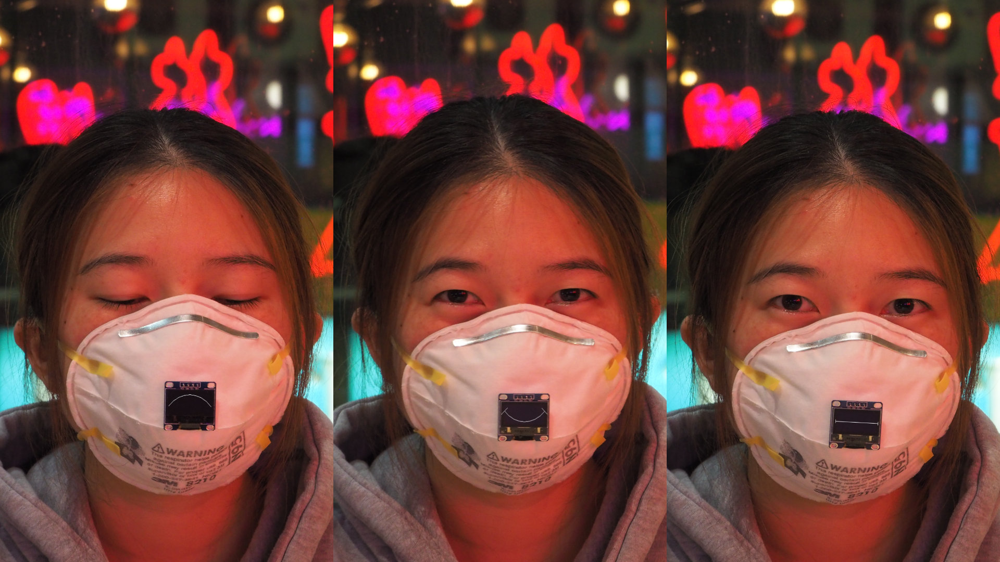
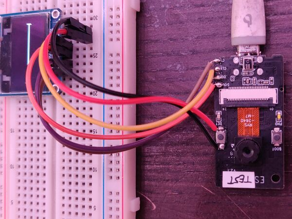

Introduction
============

This repo contains documentation for one of [our entries][2] to the
*Mask Design Challenge by FabCafe Global.* ([screenshot][3]) It won
the *FabCafe Prize.*

Hardware
========

  * ESP-EYE

  * OLED: SSD1306, SPI ([Taobao screenshot][1])

Firmware
========

Tested with:

    ESP-IDF v4.2-dev-1415-ga2263571b

To build (or extract existing build from archive):

    $ cd esp/
    $ idf.py build

To flash, remove the display, then do:

    $ idf.py -p /dev/ttyUSB0 flash --baud 2000000

License
=======

Except where noted otherwise, files are licensed under the WTFPL.

Copyright © 2020 [Felix E. Klee](felix.klee@inka.de)

This work is free. You can redistribute it and/or modify it under the
terms of the Do What The Fuck You Want To Public License, Version 2,
as published by Sam Hocevar. See the COPYING file for more details.

[1]: images/oled-on-taobao.png
[2]: https://awrd.com/creatives/detail/9650105
[3]: images/our-entry.png
